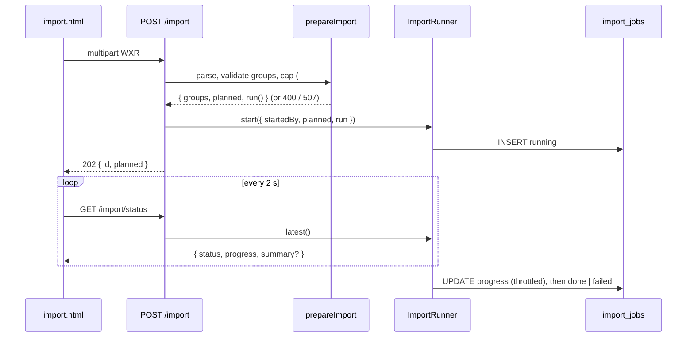

# WXR import as a background job with a progress endpoint (issue #92)

**Date:** 2026-09-05 · **Risk:** high (schema change in `uploader/src/db.ts`; boot chain; the
import pipeline) · **Size:** large
**Builds on:** `2026-07-30-wxr-import-hardening-design.md` (#85: pacing, retry, resume, single
flight), #94 (free-space pre-flight), #95 (encodes under the work-lock).
**Closes:** #92.

## Problem

`POST /import` awaits `importWxr` inside one request. At the default 1200 ms pacing a 665-photo
export is a ~13-minute request, bounded only by the reverse proxy (#72 is open). #85 made that
*survivable* — the summary goes to stdout and a re-run resumes from disk — but the author cannot
watch progress and usually never receives the response.

## Decision

Split the import into a **synchronous pre-flight** and an **asynchronous run**, and persist the
run's progress in a new `import_jobs` table so `GET /import/status` tells the truth across a
restart.



### What stays synchronous, and why

Everything that can refuse the export stays on the request path and keeps its status code:
"not a WordPress export" (400), no importable groups (400), over the distinct-image cap
(400, #96), not enough free space (507, #94), an import already running (409). These are
cheap — a parse plus resume-index probes — and an immediate refusal is a better product than a
job that fails two seconds later. `importWxr(xml, deps)` is now `(await prepareImport(xml, deps)).run()`
and every existing caller and test keeps working.

### The job model

- **One job at a time.** The single-flight rule from #85 is unchanged in substance: two runs
  would double-fetch, double the request rate against the source host and race variant writes.
  The runner owns the rule now (`start` throws `ImportBusyError` while a job is running) instead
  of a module-scoped flag in `server.ts`; the route still maps it to 409.
- **Not on `encode-queue.ts`.** The queue models many small identical jobs with a concurrency
  cap; an import is one long job with its own pacing, retry and resume, and its encodes already
  take the work-lock per photo (#95). Putting the whole run under `runShared` would hold off
  every Publish for the duration of the import — the opposite of what #95 established. So the
  runner is a small sibling module, `uploader/src/import-jobs.ts`, with the same shape as the
  queue (a pg store, a memory store for tests, `recover()` on boot).
- **Progress** is `{ groups: { total, done }, images: { planned, hosted, failed } }`. `planned`
  is the pre-flight's distinct-image count; `hosted`/`failed` are the tallies the summary already
  keeps. The live process serves progress from memory (exact); the table is written on every
  group boundary and at most every 2 s for image events, so a restart loses at most a few
  seconds of counters — never the outcome.
- **Restart.** The XML is held in memory only, so a job cannot be resumed automatically. On boot
  `recover()` marks any row still `running` as `interrupted`, keeping its last persisted
  progress. The page then shows "interrupted at N/M photos — run the import again to resume",
  which is exactly #85's documented recovery path and costs nothing for photos already on disk.
  Persisting the export to `/data` for auto-resume was considered and declined: it adds a
  parser-on-boot trust surface and a growth cap for no gain over "click Import again".
- **Failure.** The run loop already catches per-group and per-image failures into the summary,
  so `run()` throwing is unexpected (database down, bug). The job records `failed` with a fixed
  message; the underlying error goes to stdout only, per the global error-handler rule.

### Schema

```sql
CREATE TABLE IF NOT EXISTS import_jobs (
  id          uuid PRIMARY KEY,
  status      text NOT NULL CHECK (status IN ('running','done','failed','interrupted')),
  started_by  text NOT NULL,
  started_at  timestamptz NOT NULL DEFAULT now(),
  updated_at  timestamptz NOT NULL DEFAULT now(),
  finished_at timestamptz,
  progress    jsonb NOT NULL,
  summary     jsonb,
  error       text
);
CREATE INDEX IF NOT EXISTS import_jobs_started_idx ON import_jobs (started_at DESC);
```

Additive; no existing table changes. Operational state, not content: **excluded from the DB
backup** (`backup.ts` dumps `users`/`posts`/`pages`/`media`) and untouched by restore. Rows are
pruned to the newest 20 on each insert so the table cannot grow without bound.

### Endpoints

- `POST /import` (admin) — unchanged request; on success **202** `{ id, status: 'running',
  planned }`. Refusals keep their codes (above).
- `GET /import/status` (admin) — `{ job: ImportJob | null }`, the running job or the most
  recent one. `ImportJob = { id, status, startedBy, startedAt, updatedAt, finishedAt, progress,
  summary, error }`. `summary` is the same `ImportSummary` the old 200 carried (warnings capped
  and vague, #85/#90), so this endpoint discloses nothing the old response did not.

### UI (`public/import.html`)

Submit → 202 → poll `/import/status` every 2 s until the job is not `running`. A native
`<progress>` with an `aria-live="polite"` count line replaces "Importing…"; the finished
summary renders through the existing bucket/callout code. On page load the page asks once: a
running job (the tab was closed) is picked up and polled; the last finished job's summary is
shown, with an "interrupted" callout when the server restarted mid-run. The Import button is
disabled while a job runs.

## Trust boundaries and misuse cases

- Both routes are `requireAdmin` (#97). The status payload is the same summary an admin
  already received, plus counters.
- Concurrency: `start` is the only place a job is created and it checks `current()` first;
  the boot `recover()` runs before `listen()` so no request can observe a stale `running` row
  as busy.
- A job cannot outlive its process in the `running` state: `recover()` on next boot.
- No new outbound-fetch, path or parser surface. The parts loop, `safeFetch`, `assertSafeKey`,
  resume and the work-lock are untouched.

## Invariants (tested)

- `importWxr` ≡ `prepareImport(...).run()` — every pre-#92 importer test passes unchanged.
- Pre-flight refusals (400 no groups, 400 cap, 507 space) happen before any job row exists.
- `start` while running → `ImportBusyError` → 409; a finished job frees the slot.
- Progress monotonic: `groups.done` ≤ `groups.total`, `hosted + failed` ≤ `planned`.
- `recover()` flips `running` → `interrupted` and nothing else.
- Boot order: `ensureSchema` → `importJobs.recover()` → `listen()`.

## Rollback

Revert the commit. The table is additive and harmless if left behind; the route returns to the
synchronous 200 and the page to its previous behaviour. No data migration.
